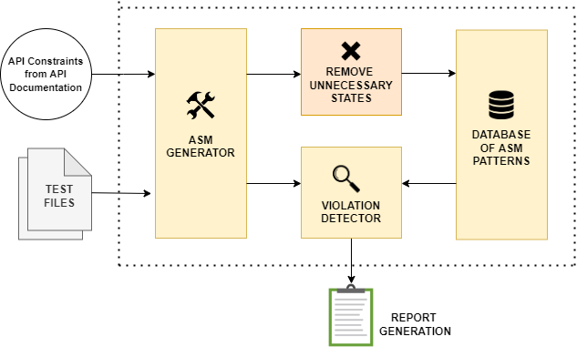
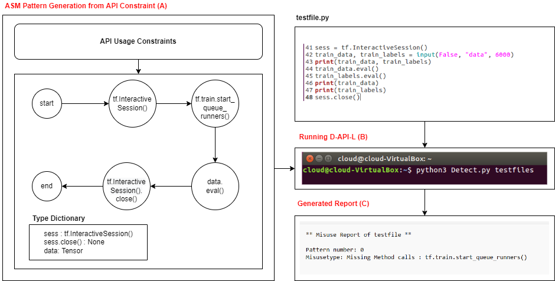

# D-API-L: A tool for detecting API Misuses in Python Deep Learning Libraries

###Features
----
- Generates API State Machine (ASM), an FSN based representation of API usage constraints
- Detects nine API misuse patterns
- Classifies detected misuses into different categories and generates a report

###Working of D-API-L
----

- ASM Generator: This componenet builds the ASM for a python code using the control flow graph and outputs the ASM pattern in JSON format
- Database of ASMs : This consists of multiple ASM pattern extracted from API Documentation information. This can be easily extended by building new ASMs and storing it in JSON format
- Violation Detector: It uses a recursive algorithm to check the states of a test file with that of the patterns in the database and reports any violations found.

###Overview
----
The tool has been tested on Linux 64bit and we recommend using Linux.

###Installation
----
- Install **pycfg** from https://pypi.org/project/pycfg/ (*pycfg requires internal library installations for **graphviz, pygraphviz** and **astunparse***)

- Clone or download this github repository:

    git clone https://github.com/rishalab/D-API-L.git

- Get into the main directory:
 
 

    cd D-API-L

- Paste your test file into the testfiles folder
- Run the *Detect.py* file

    python3 Detect.py testfiles

##Usage Example

Run the following command from the command line

    python3 Detect.py testfiles

The detector will run and output the report for any API misuse detected.

###Folder Structure

+ ASMs
	+ issues
		+ deprecated.json
		+ wrongcall.json
	+ NoArg_patterns.txt [*This contains ASM patterns*]
+ testfiles [*Folder for keeping test files*]
+ pycfg-0.1 [*Folder containing pycfg files*]
+ ASM.py [*Builds the ASMs*]
+ createASM.py [*Utility code for creating ASM patterns*]
+ Detect.py [*main file for running the tool*]
+ matching.py [*Violation detection and report generation*]

###Demonstration Video

The demonstration video can be found on Youtube using the following link: https://youtu.be/ypgu_DHiXvs

###Contribute

We will be happy to receive any kind of contributions. Incase of a bug or an enhancement idea or a feature improvement idea, please open an issue or a pull request. Incase of any queries or if you would like to give any suggestions, please feel free to contact Prantik Sarmah (cs20m010@iittp.ac.in) or Sridhar Chimalakonda (ch@iittp.ac.in) of RISHA Lab, IIT Tirupati, India.
